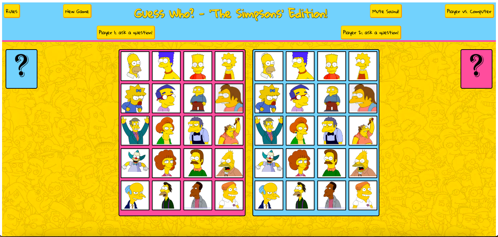

# The Simpsons' 'Guess Who?' : SEI Project 1        

        

## Description:     
This is a frontend web game - _The Simpsons_ themed _Guess Who?_ - built solo 'from scratch' in 1 week. Completed as my first project for General Assembly London's Software Engineering Immersive course, presented to my Instructional Team and fellow cohort on 26/08/22.            

     

## Links:       
[Deployment link](https://pages.git.generalassemb.ly/hphilpotts/project1-hp-guesswho/)      
[Google Doc README](https://docs.google.com/document/d/1ZMBQ_S5oBLUA-81iI_ykc59TUdvBHnj5S-SqFv_QKpU/edit#)      

## Install:     
To contribute to this project, please fork from [GitHub](https://github.com/hphilpotts/Simpsons-Guess-Who-Project-1-General-Assembly-SEI-66) and submit a pull request. No installs are required in order to contribute.        

## Technologies used:       
- HTML, CSS, JavaScript, jQuery     
- Written in Visual Studio Code     
- Project boards on trello.com, Wireframes on good old pen & paper      
- Hosted on GitHub Pages        

## Brief & Project aims:       
The brief for this project was to build a web-based game from scratch using my knowledge of HTML, CSS and JavaScript gained in the first two weeks of the SEI course. Technical requirements included:      
- Separate HTML/CSS/JS files        
- Use semantic markup for HTML and CSS (adhere to best practices)       
- Stick with KISS (Keep It Simple Stupid) and DRY (Don't Repeat Yourself) principles        
- Have well-formatted, and well-commented code      
- Use JavaScript and/or jQuery for DOM manipulation     
- Deploy your game online, where the rest of the world can access it        

The ostensible aim of the project was to consolidate learning from the first unit of the course, through practical application of the skills and technologies covered. More importantly though, this project was a first simulation of working in a professional environment. It provided an inital introduction to coding independently, working to a brief and to a timescale; encompassing all stages of product development: from planning, to production, to deployment and presentation.       

## Key learnings:       
As my first ever foray into     

## Successes and Challenges:         

## Bugs:        

