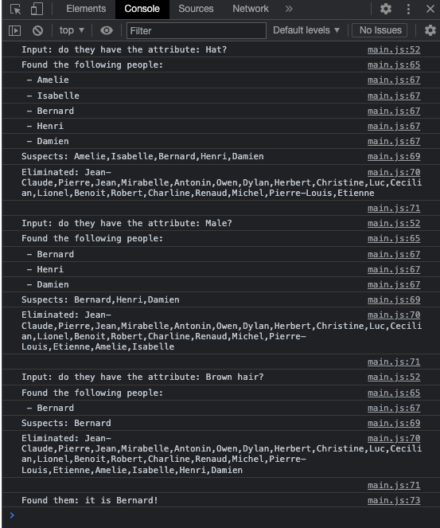

# SEI-66 Project 1:     
### - build a game from scratch!       

# 'The Simpsons':'Guess Who?'        

## Technologies used:       
- HTML, CSS, JavaScript     
- jQuery
- Code written in _Visual Studio Code_      
- Repository hosted on _GitHub Enterprise_      
- Kanban boards on _trello.com_
- Wireframes on _good old pen & paper_      

## Links to Wireframes and User Stories:        
[User Stories - Trello Board](https://trello.com/b/inPyVyln/project-01-user-stories)       
[Project Kanban - Trello Board](https://trello.com/b/4Ooc6PXD/project-01-kanban-board)      


## Project Timeline:        
### 18/08/22: Beginning the project     
- Decided upon _Guess Who_ after weighing up options, doing Opportunity/Risk analysis.      
- Set up GitHub repository for project, established basic file structure, added README, first commit made.      

### 19/08/22: Planning stages       
- Trello boards set up to map progress, user stories.       
- Initial wireframe sketched out on paper to plan UI based on user stories.     
- Game 'flow' mapped out to begin to plan functionality based on user stories.      

### 19/08/22: First steps
- Linked HTML, CSS, JS and jQuery files.        
- Basic data structure set up (`object` with `name:array` pairs), simple function written to test how to sort/eliminate chararaters based on characteristics.      
- Basic page layout built.    

### 22/08/22: First branch      
- Restructured data into array of objects.      
- Adding early functionality, game now 'playable' thanks to the addition of character randomiser and guess buttons with corresponding alerts.      
- Full set of 20 characters added.      
- Player 2 functionality added.         

### 23/08/22: UI/Design Focus       
- Font family added, worked on backgrounds and colour palette.             
- Buttons/boxes formatted to match theme.       
- Dropdown menus formatted and repositioned.        
- 'Rules' button functionality added.       
- 'Mystery' card functionality added with images populated from `char` objects.     
- `alert()`s changed to 'Pop up' elements instead to allow for formatting / more functionality.     
- Sounds added to most buttons / actions.       

### 24/08/22: (headline here)       
- Background music added on loop.       


---     

## 18/08/22: Beginning the project:        
- Settled on _Guess Who?_ - or some variant thereof - as my choice of game to build. I came to this decision on the basis that it is simple enough to be achievable in the timeframe given: I'd much rather execute a simple idea well than overcommit and end up with a half-finished project. A version of this game was included in the examples shown before the project, I also took advice from a GA alum who agreed that it would make for an interesting (and achievable) project. See section 'What might have been...' below for rejected ideas!        
- Repository established, basic file structure set up, README started.       

### Opportunities identified:      
- Game should be an achievable project in time given.       
- Not an 'action' game with many simultaneously moving parts so it should be easier to animate well.        
- Programming the computer to guess will likely be an interesting challenge.        
- Potential for both Player vs. Computer and Player vs. Player modes.       
- Short game duration - minimises risk of code breaking down.       
- Well-known game with simple concept and rules - familiar and accessible to most.       
- It's a fun game to play!      

### Potential risks:      
- Possibly under-ambitious? Better than the opposite though!        
- Game might not be visually compelling enough - characters must be interesting to look at and animations need to be slick.     
- Game art is not something I am naturally good at. It's important I push myself here but there is a risk of this area becoming a significant time-sink.        
- 'AI' could be under/over powered - need to ensure balanced gameplay.      
- PvP on one screen may be a challenge - how to ensure player's cards/choices remain secret?        

## 19/08/22: Planning Stages:      

- I began today by mapping out a rough flowchart setting out the stages of the project, before moving on to setting up Trello boards to map out progress for the project and for the user stories. This is my first real experience using Kanban - something I have seen on a lot of Job Descriptions.      
- _There is a real risk of procrastination here: as much as it is nice setting up visually interesting Trello boards, I need to be careful that this doesn't become a displacement activity...!_        
- Boards now set up. User stories added to Trello board. Off the back of these I then sketched out a very rough first wireframe and high-level 'Game flow' flowchart below. I really like using pen and paper for this! Quick, if a little illegible:       

        

     

- I'm starting by simply linking my HTML, CSS and JS files - jQuery included - and then testing that the page has worked. I can then run Inspector (sinister sounding!) from this page, crucial for testing everything else I go on to do. It works.        

          

## 19/08/22: First steps:       

- The next thing I am going to do is to set up my characters' characteristics. This is surely crying out for a JS object, right? _If you understand objects, you understand JavaScript, they say_. I'm going to see if I can find 'true to the real game' information, as the distribution of characteristics will affect how the game plays: if it ain't broke then I ain't fixing it...       
- Found an [interesting article](https://edge.ua.edu/andie-alexander/guess-who-a-game-of-differentiation/) on _Guess Who?_ that (aside from posing some important critiques of how the game) also offers insight into how weighting of characteristics can dramatically affect the game, even to the point of 'breaking' it.        
- Also found pre-loaded 'Character Characteristics' from [codewards.com](https://www.codewars.com/kata/58b2c5de4cf8b90723000051) - I'm going to use these as a starting point, I can always adjust and amend later. I've structured the data at this stage as follows:      

```
obj = {
    character: [array, of, characteristic, strings],
    character2: [array, of, different, strings]
}
```     

- I'm now going to write a simple function that takes a characteristic and returns the characters that have that characteristic. I'm going to save the potential choices in an array.       
- Needed to refresh my knowledge a little but got there in the end. Code is as follows:    

```
function findCharacters(attribute){
    const guess = [];
    for (const character in characterList) {
        const checking = characterList[character]
        if (checking.includes(attribute)){
            console.log(`Found someone: ${character}`);
            guess.push(character);
        }
    }
    console.log('');
    console.log('Found the following people:');
    guess.forEach(element => {
        console.log(` - ${element}`);        
    });
}
```       

- I'm now going to set up arrays of 'potential characters' and 'eliminated characters' to allow for repeat elimination. Added to the original function - and it works!      
```
const suspect = (Object.keys(charList));
const eliminated = []

function findCharacters(attribute){
    console.log(`Input: do they have the attribute: ${attribute}?`);
    const guess = [];
    for (const character in charList) {
        if (suspect.includes(character)){
            const checking = charList[character]
            if (checking.includes(attribute)){
                guess.push(character);
            } else {
                eliminated.push(character);
                suspect.splice(suspect.indexOf(character), 1);
            }
        }
    }
    console.log('Found the following people:');
    guess.forEach(element => {
        console.log(` - ${element}`);        
    });
    console.log(`Suspects: ${suspect}`);
    console.log(`Eliminated: ${eliminated}`);
    console.log('');
    if (suspect.length === 1){
        console.log(`Found them: it is ${suspect[0]}!`);
    }
}

findCharacters("Hat");
findCharacters("Male");
findCharacters("Brown hair");
```     
      

- Eliminator function has been a good test of how to narrow down a list of characters using logic. I will leave this for now (but will incorporate it later when adding P v. AI mode). I'm going to build towards Player v. Player functionality first as it will be simpler!              
- I'm now wondering if my current data structure is best for my requirements: currently `obj{ name: [attributes] ... }` but I could also use `array [ {name: 'name', attribute: 'attribute}, {...} ]`. I've asked the question as to which should be better!       
- I'm also trying to set up a drop-down button as a very rough first version. _On second thoughts, drop-downs look a nightmare, I'll do buttons_. Taking a break from the JS side and now starting to build a rough framework on which to start to build.        
 - I've had some advice on my data structure: an array of objects is a better approach. I should also use constructors to keep my code DRY. I'll revisit this Monday 22/08/22 in order to restructure my data.      

 - Some good progress made on the rough framwork front:      
        
 - Use of `height: ##vh` has been helpful in providing consistent appearance regardless of screen shape/size. I've found this, along with min heights/widths useful in maintaining proportion as the screen size changes.       

 ## 22/08/22: First branch:     
 - I've started today by reading back over Friday 19/08/22's work and my readme. I'm pretty happy with what I have got so far. Today I'm going to tackle restructuring my data: I have created a new branch to allow for this so that I do not lose my work so far if things go wrong!      
 - I've also made the decision to use _The Simpsons_ characters for my version of _Guess Who_: varied and defined physical characteristics, easy to source images.      
 - Previous js code moved into `objArrCode.js` in order to clean up the `main.js` file but keep code available for reference if needed.         

 - New data structure set up with 5x test characters, using constructor that pushes to array. Test logs all working ok:         
 ```
 const charArr = [];

function char(name, male, child, hairColour, facialHair, glasses, suspect = true){
    this.name = name;
    this.male = male;
    this.child = child;
    this.hairColour = hairColour;
    this.facialHair = facialHair;
    this.glasses = glasses;
    this.suspect = suspect;
    charArr.push(this);
}

let homer = new char("Homer", true, false, "bald", true, false);
let marge = new char("Marge", false, false, "blue", false, false);
let bart = new char("Bart", true, true, "yellow", false, false);
let lisa = new char("Lisa", false, true, "yellow", false, false);
let milhouse = new char("Milhouse", true, true, "blue", false, true);

// Test logs:
console.log(charArr);
console.log(homer);
console.log(marge.glasses);
const suspect = charArr.filter(char => char.name == 'Lisa'); // useful!
console.log(suspect);
```         
- Character randomiser added and working.       

- I'm now looking into adding functionality where the user can ask a question about the character they are trying to guess. In order to reduce visual clutter, I plan to have the buttons where the user asks a question hidden until a button is clicked.      
- Adding button functionality. I've split the buttons into categories, broadly along whether the button is checking for a `string` value in the `guessMe` object as follows:        
```
    <button onclick="answerString('blue')">Blue</button>
    <button onclick="answerString('grey')">Grey</button>
```
```
function answerString(attribute){
    let response = (Object.values(guessMe).includes(attribute));
    console.log(response);
}
```         
- or checking for a `boolean` value as follows:     
```
    <button class="true-bool" id="male">Male</button>
```
```
$('#male').click(function(event){
    response = guessMe[event.target.id];
    console.log(response);
});
```     
- _The reason for this is that I haven't been able to input an argument that isn't a string into the `button onclick="function(argument)"`, but I haven't been able to convert a string passed as an argument into a variable name using `eval()`. I've spent far too much time on this so have decided on this as a workaround!_     
- Further to the above, I have added code that replicates the code for `$('#male')` for all `class="true-bool"` buttons as follows:         
```
const trueBoolButtons = $('.true-bool');

for (let i=0; i < trueBoolButtons.length; i++){
    let buttonId = trueBoolButtons[i].id;
    console.log(buttonId);
    $(`#${buttonId}`).click(function(event){
        response = guessMe[event.target.id];
        console.log(response);
    });
}
```
_Again - I've spent too much time getting this to work! I'm quite conscious that I am spending more time trying to make my code as 'DRY' as I can than I would if I just wrote out simple, repetitive code. Clearly a balance to be struck here!_       
- First task after lunch is soring out false-bool buttons. I've given them an id of `"not-`"trueBoolId" - this is in order to maintain code already written that uses the 'true-bool' button id to run. With the use of `!object.key` and `substring(4)` this works as below:       
```
    <button class="false-bool" id="not-child">an Adult</button>
```
```
    // within similar function to trueBoolButtons above:
    [...]
    response = !(guessMe[(event.target.id).substring(4)]);
    [...]
```     
- Tests work! We are getting some way towards having useable funcitonality. Now I'm going to add a 'Guess Character' form inside the button box so that our player can make a guess after asking questions:         
```
    <form id="guess-form" role="search">
        <input type="text" id="makeGuess" placeholder="I think your character is...">
        <button id="submit-button">Make a guess!</button>
    </form>
```
```
document.getElementById('submit-button').addEventListener('click', function(){
    event.preventDefault(); // showing as deprecated, what should it be instead?
    let guess = document.getElementById('makeGuess').value;
    if (guess.toLowerCase() == guessMe.name.toLowerCase()){
        alert("You guessed correctly!")
    } else {
        alert("No, try again")
    }
})
```
- By switching `console.log()`s for `alert()`s, the game is now (just about) playable! Validation added to guess box as well.      
       
- Next step - adding intial character images to the 'board'. `fadeOut()`s added when character is clicked on to replicate the action of flipping a character down in the physical board game.       
- Added 15 more characters to board, added respective objects to main.js.       
- Added second board for P2. Minor css changes to clean up look a little where `<div>` differentiation by colour no longer needed.      
- Second set of buttons added for player 2. PvP now working. _I've had to create duplicate functions, classes and ID's to again get around the fact that I would otherwise be re-using element ID's. Not especially DRY but I can come back and refactor later_.        
- **Should have branched before making these recent changes! Initially 'broke' the code and took a lot of adjustment to get working again!**        
- Overall a big piece of work: I kept on finding that the LH buttons were also triggering the RH button functions. Solution is a bit of a messy one where I doubled down on having two sets of parallel id's and then converted the RH ones by removing the 'R' from the id name in order to pass the corrected ID name into the RH function. _I'm sure there is a cleaner way but at this point I am focusing on just getting functional code out there before tidying things up / reworking things later!_        
- Progress at close 22/08/22:       
        

## 23/08/22: UI / Design Focus:         
- Now that I have 2 Player functionality - sucessfully tested as working - my focus today will be around improving UI, design and styling. This way if I get pinched for time, I will still have a workable (and crucially, submittable) project. Player vs. computer can come later, if there is time!     
- Font added ('Gloria Hallelujah - from Google Fonts), colour palette chosen based on: 'Simpson' yellow, sky blue, 'donut' pink. Background added - _can be changed later if improved choice found_.               
- Button styling added. Borders added to most elements.         
- Used: `box-sizing: border-box;` in order to add border inside character boxes: this does not impact the spacing and helps minimise the whitespace below images (_look at fixing whitespace further on!_).         
- Overall look greatly improved after ~1hr of work!         
 
---     
- 'cards' to the left/right edge of the board resized as they would go square on wider screens.     
- Now working on formatting the dropdown menus, fixing a snag where they drop and cover the majority of the board.      
- Decided the workaround would be to add instruction to show/hide box: the edges of the screen are too narrow, having the box cover the other side of the board does not look/feel right from a user perspective.       
- Boxes now look as follows, further buttons to be added later - space allows for this:     
      
- Next task: populating 'Guess Who' cards on LH and RH sides. The first thing I realise is that I could (/should) have stored the character image paths within the char objects...doing so now.         
- Now that I have done this it is relatively easy to populate these using jQuery to append an img with a source of `guessMe.image`:         
```
$('#right-card').append('')
```
- And I can hide/reveal like so:        
```
$('.card').click(function(){
    $(this).children('img').toggleClass('hidden');
    }
)
```         
- Question Mark images added to cards with `.hidden` toggled off: they show by default on load but hide when the character image is shown, and vice versa.      
- Hidden Character images on cards will toggle to shown when a correct guess is made. Delay added to page reload / alert message to improve feel.       
---         
- Taking a break from styling to add comment to my code as it is getting harder to navigate! Will allow me to collapse sections I am not working on but still be able to find them easily. Also will make my code a bit more readable when I need help!         
---     
- Now changing alerts to popup divs instead. Intial plan is to use a function to create (and subsequently remove) a div, that will work across all button functions.        
- Early tests are working fine but I am having issues where the closePopUp function attached to the 'ok' happens before a click happens. For the moment I am instead setting a 2000ms timeout before closing the box.       
- Popup styling lifted from dropdown menus in order to maintain consistent look.        
```
function popUp(words){
    $('body').prepend('<div class="dropdown-menu popup" id="pop-up"><p>' + words + '</p><button id="ok">Ok</button></div>');
    setTimeout(() => {
        $(closePopUp());
    }, 3000);
}

function closePopUp(){
    console.log('close');
    $('#pop-up').remove();
}
```     
- Now adding above popUp function to all guess button functions in order to replace alerts used previously.     
- Had to add second argument `size` to `popUp` function in order to trigger larger boxes when required (e.g. for Guess attempts)        
---     
- Adding sound effects to buttons, popups.      
- Rules box added so that 'Rules' button now has functionality.     

## 24/08/22: (headline here):       
- Background music added. Used `loop="true"` HTML attribute in order to loop. Was going to write a recursive function but this was simpler! _Commented out the `musicLoop()` function for now because I can't listen to that music literally all day or I'll go insane..._          
- Adding sound to 'mystery' cards: now this is done, all actions/clicks have a sound effect which has significantly improved the feel of the game.      
---

- _The finish line is in sight with the project due to be presented in 48 hours' time. I'm happy that I have got to a playable level of functionality at this stage. I now need to make the best use of the time that remains: setting ambitious goals could significantly improve my project, too ambitious and I risk ending up with half-finished work._       
---     
- I've elected to try to get through as many 'quick wins' in my 'unsolved issues' list as I can: these should be easily achieveable and will together deliver lots of small improvements that lift the project as a whole. **Branched into 'quick-wins'**      
- Firstly: adding 'alt names: e.g.: `['Abe', 'Grandpa', 'Grandpa Simpson']`' - at the moment, the player must guess the name I have specified and all other versions will be rejected.      
- Step 1: was initially change `char.name`s from strings to arrays, however I realised that I may break code that relies on `.name` being a string. Instead I am going to add another `key:value` of `altNames: [arr]` as this will only be required for the 'solving for winner' event code (left and right side).     
_So this is why we branch...I've now broken the 'solve for winner' code which is far too complicated and should be modular. An hour of work and no progress, so much for 'quick fixes'..._  - I am going to copy the readme updates I have made so far and bin the 'quick-wins' branch which was, in hindsight, a terrible name.    
- I'm going to start again, but this time I'm going to begin with rewriting my 'solve for winner' code. **Branched into 'rewrite'**     
- Partway through first attempt at rewriting:       
```
// Function to run when either submit button is clicked
function guessMade(inputSide, characterToGuess){
    // gets user input from correct input element, convert to lower case, save in variable:
    let guess = document.getElementById(inputSide).value.toLowerCase();
    // function to see if guess is a positive match
    // checkPositive() goes here
    // function to run if win is the case
    winner();
    
    // function to see if guess is a negative match
    // checkNegative() goes here
    // function to run if wrong is the case
    wrong();

    // function to see if guess is an error
    // checkError() goes here
    // function to run if error is the case
    error();

    // Hide menu - find a way of hiding the correct menu!
    hideMenu(inputSide);
}
// Are three functions ( checkPositive(), checkNegative(), checkError() ) the right choice or is a single function better here?
function checkPositive();
function checkNegative();
function checkError();

// can these three (winner, wrong, error) be combined into a single function that takes a value and runs switch /if else if else to determine which block to run?
function winner(){
    // $('#right-card').children('img').toggleClass('hidden'); - find a way of turning the correct card!
    document.getElementById('winner').play();
    popUp("Woohoo! You guessed correctly!", 'large');
    setTimeout(() => {
        location.reload();
    }, 3000);
}
function wrong(){
    document.getElementById('wrong').play();
    popUp("D'oh! Try again", 'large');
}
function error(){
    document.getElementById('sad').play();
    popUp('Not a character. Remember: trying is the first step towards failure.', 'large');
}

function hideMenu(inputSide){
    if (inputSide === 'makeGuess'){
        showLeftMenu();
    } else {
        showRightMenu();
    }
}
```     
- Rewritten, without altName functionality added:       
```
// Function to run when either submit button is clicked
function guessMade(inputSide, characterToGuess){
    // gets user input from correct input element, convert to lower case, saves in variable:
    let guess = document.getElementById(inputSide).value.toLowerCase();
    // checks if guess is correct character name, wrong character name, error character name:
    let checkedGuess = checkGuess(guess, characterToGuess);
    // Executes code based on output of checker function:
    guessResult(checkedGuess, inputSide)
    // Hides menu (unless game ends with winner and page refreshed)
    hideMenu(inputSide);
}
// Single checker function:
function checkGuess(guess, characterToGuess){
    let output = ''
    if (characterToGuess.name.toLowerCase() === guess){
        output = 'winner';
    } else if (charArr.filter(obj => obj.name.toLowerCase() == guess).length == 1){
        output = 'wrong';
    } else {
        output = '';
    }
    return output;
}

// I've decided on 'if, else if, else', in one function:
function guessResult(checkedGuess, inputSide){
    if (checkedGuess === 'wrong'){
        document.getElementById('wrong').play();
        popUp("D'oh! Try again", 'large');
    } else if (checkedGuess === 'winner'){
        // Below if/else is messy and a symptom of poor planning...but still works
        if (inputSide === 'makeGuess'){ $('#right-card').children('img').toggleClass('hidden');
        } else { $('#left-card').children('img').toggleClass('hidden'); }
        // and then this ends the game
        popUp("Woohoo! You guessed correctly!", 'large');
        setTimeout(() => {
            location.reload();
        }, 3000);
    // No need to check for error - an else statement will do the job instead!
    } else { 
        document.getElementById('sad').play();
        popUp('Not a character. "I dunno, Marge. Trying is the first step towards failure."', 'large');
    }
}

function hideMenu(inputSide){
    if (inputSide === 'makeGuess'){
        showLeftMenu();
    } else {
        showRightMenu();
    }
}
```     
- I've now removed my old, messy code and have implemented the new code.


## Unsolved Issues:    
- Show chars again when re-clicked.                
- Add close / ok button functionality to popups        
- alt names: e.g.: `['Abe', 'Grandpa', 'Grandpa Simpson']`          
- add further questions  
- add timeout to sounds: too responsive            
- add better sounds?   
- add victory animation?        
- animate: reveal character card on edges       
- enforce turns         
- P v AI?           
- draggable dialogue boxes?     
- whitespace below character images: crop to ensure all images square?      
- CSS needs refactoring

## Solving for the winner:         
```
// Function to run when either submit button is clicked
function guessMade(inputSide){
    event.preventDefault();
    // gets user input from correct input element, convert to lower case, saves in variable:
    let guess = document.getElementById(inputSide).value.toLowerCase();
    console.log(guess);
    // sets character to guess based on inputSide (had to do this as I can only pass a string argument into a function within an onclick html attribute...):
    let characterToGuess = guessMe;
    if (inputSide === 'makeGuessR'){
        characterToGuess = guessMe2;
    }
    // checks if guess is correct character name, wrong character name, error character name:
    let checkedGuess = checkGuess(guess, characterToGuess);
    // Executes code based on output of checker function:
    guessResult(checkedGuess, inputSide)
    // // Hides menu (unless game ends with winner and page refreshed)
    hideMenu(inputSide);
}
```

## Highlights: favourite functions / code snippets:     
I'm pleased with my re-written 'solving for the winner code' (see above) given where it was before (see below...)!

```
// Old 'solve for winner':
document.getElementById('submit-button').addEventListener('click', function(){
    event.preventDefault(); // showing as deprecated, what should it be instead? Works though.
    let guess = document.getElementById('makeGuess').value.toLowerCase();
    if (guess == guessMe.name.toLowerCase()){
        $('#right-card').children('img').toggleClass('hidden');
        document.getElementById('winner').play();
        popUp("Woohoo! You guessed correctly!", 'large');
        setTimeout(() => {
            location.reload();
        }, 3000);
    } else if (charArr.filter(obj => obj.name.toLowerCase() == guess).length == 1) {
        document.getElementById('wrong').play();
        popUp("D'oh! Try again", 'large');
    } else {
        document.getElementById('sad').play();
        popUp('Not a character. Remember: trying is the first step towards failure.', 'large');
    }
    showLeftMenu();
})
document.getElementById('submit-buttonR').addEventListener('click', function(){
    event.preventDefault(); // showing as deprecated, what should it be instead? Works though.
    let guess = document.getElementById('makeGuessR').value.toLowerCase();
    if (guess == guessMe2.name.toLowerCase()){
        document.getElementById('winner').play();
        $('#left-card').children('img').toggleClass('hidden');
        popUp("Woohoo! You guessed correctly!",'large')
        setTimeout(() => {
            location.reload();
        }, 3000);

    } else if (charArr.filter(obj => obj.name.toLowerCase() == guess).length == 1) {
        document.getElementById('wrong').play();
        popUp("D'oh! Try again",'large');
    } else {
        document.getElementById('sad').play();
        popUp('Not a character. Trying is the first step towards failure.','large');
    }
    showRightMenu();
}
```

## What might have been...(rejected ideas):     

### Cluedo:     
- Too ambitious! Potentially a very interesting project but was warned off this, especially due to the challenges around handling multi-directional character movement as well as game duration: "long game = code more likely to break".       
- Multiple players: either needs 6 people to play on one screen (cumbersome/clumsy) or 5 separate 'AI' (probably beyond my current skillset). One for the future, maybe!        

### Scrabble:       
- Would require a dictionary-type API? No way I'm going to manually input every word in the dictionary! 'Scrabble - but only with words beginning with 'A'' not likely to become an instant classic.        
- Programming a computer opponent that doesn't just choose the optimal word each time is going to be a problem.     

### Bohnanza:       
- I love this game, but not many people have heard of it!       
- Also quite a long game and faces similar AI issues as above.      

### Battleships:        
- Great game and fun project but my friend already did this!        