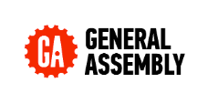

<p align="center">
    
</p>

# The Simpsons' 'Guess Who?' : SEI Project 1        

## Description:     
This is a frontend web game - _The Simpsons_ themed _Guess Who?_ - built solo 'from scratch' in one week using primarily HTML, CSS, JavaScript and jQuery. I built this as my first project for General Assembly London's Software Engineering Immersive course, and presented a deployed version to my Instructional Team and fellow SEI cohort on 26/08/22.            

     

## Links:       
[Deployment link](https://pages.git.generalassemb.ly/hphilpotts/project1-hp-guesswho/)      
[Google Doc README](https://docs.google.com/document/d/1ZMBQ_S5oBLUA-81iI_ykc59TUdvBHnj5S-SqFv_QKpU/edit#)      

## Install:     
To contribute to this project, please fork from [GitHub](https://github.com/hphilpotts/Simpsons-Guess-Who-Project-1-General-Assembly-SEI-66) and submit a pull request. No installs are required in order to contribute.        

## Technologies used:       
- HTML, CSS, JavaScript, jQuery     
- Written in Visual Studio Code     
- Project boards on trello.com, Wireframes on good old pen & paper      
- Hosted on GitHub Pages        

## Brief & Project aims:       
The brief for this project was to build a web-based game from scratch using my knowledge of HTML, CSS and JavaScript gained in the first two weeks of the SEI course. Technical requirements included:      
- Separate HTML/CSS/JS files        
- Use semantic markup for HTML and CSS (adhere to best practices)       
- Stick with KISS (Keep It Simple Stupid) and DRY (Don't Repeat Yourself) principles        
- Have well-formatted, and well-commented code      
- Use JavaScript and/or jQuery for DOM manipulation     
- Deploy your game online, where the rest of the world can access it        

One clear aim of the project was to consolidate learning from the first unit of the course, through practical application of the skills and technologies covered. More importantly though, this project was a first simulation of working in a professional environment. It provided an inital introduction to coding independently, working to a brief and to a timescale; encompassing all stages of product development: from planning, to production, to deployment and presentation.       

## Key takeaways and learnings:       
This project holds a special place for me, as it represents the point at which I felt fully validated in my decision to commit to a career change. Being given the freedom to create anything I wanted, starting to find my own coding rhythm, happily losing hours at a time engrossed in code with my headphones on, and finally seeing my efforts come together into a project I was genuinely proud of: these experiences were confirmation that this was something I genuinely enjoyed (and wasn't too bad at either)!          

     


This project also built my confidence in using HTML and JavaScript in a practical application, and it really helped my understanding of DOM manipulation, with and without jQuery. I had struggled with CSS positioning in the two weeks before the project (and - if I'm honest - during the project too!), however getting positive feedback on how my app was shaping up was another great confidence booster. Lastly, it gave me a great introduction to project work as a whole, particularly Wireframing, project planning and management, and Git version control.       

My most significant points of learning were mostly around planning and finding balance in my approach:     
- Structuring my code well early on is a huge driver of success, and this all starts in the planning phase. It is quite easy to 'paint yourself into a corner' if the planning isn't right. See, for example: challenge encountered when scaling up from one 'side' of the board to a second (screenshot below), or mobile-responsive CSS issue in _Bugs & Issues_ further down in README.     
- Don't be over ambitious: instead be realistic about what is achievable in the timeframe given. As deployment day approaches, aim for fixes or additions that deliver the most in the shortest time.       
- It is important to find a balance between 'clever', condensed code that takes longer to write, and simpler, longer code that may be less elegant but delivers functionality more quickly. You can always go back and refactor - although the earlier this is done, the better!       
- Breaks are important! Whether that is as substantial as stepping outside for a walk (oftentimes when those 'Eureka' moments come), switching to a new task, or anything in between.       
- Branches are there for a reason: don't spend hours having to unpick an issue with your code because you forgot to commit regularly...     
- Finding code 'on the fly' to demostrate whilst presenting is a real challenge when files get longer and more numerous: perhaps solve this through bookmarking, using presentation slides, or isolating code snippets. The last thing you want is long and awkward pauses as you scroll back and forth when screensharing!          

     

## Successes and Challenges:         
I would regard my biggest successes from this project as being the gains in my confidence, knowledge and understanding from completing this project, as well as the often stark lessons learned around how to approach project work. Further to this, delivering something I was proud to show off was a great feeling, as was getting positive feedback from my peers and instructors.     

At the time, I was particularly pleased with my refactored (and indeed restructured) 'Solve for Winner' code:       

     

Which previously was:       

       

Lastly, I would regard the visuals achieved as a singificant success, especially given my percieved confidence/compentence with CSS at the time. Getting really positive feedback from our TA the first time I demonstrated my app was a great confidence boost the day before presenting the project!        

## Bugs & Issues:       
- App is not fully responsive and will not work on mobile devices as a result: a full overhaul of the CSS is required as part of a 'mobile-first' approach, particularly where `px` has been used for sizing and positioning. CSS also requires refactoring where code is not 'DRY'.      
- Characters do not display again when clicked on for a second time.        
- Whitespace below character images is uneven.      
- BGM does not always play on first load: likely fix requires `canplaythrough` Event Listener.      
- P v. AI functionality not implemented - button is present however!        

## Production Process:    

### 18/08/22 | Day 0 | Brief issued:               

I decided on the idea of a _Guess Who?_ game: this felt like an achievable idea in the timeframe given, was likley to be familiar to most users, required relatively few 'moving parts', and game duration is typically short (meaning less time for things to break!).     

The risks I identified were that: this could possibly be under-ambitious / not visually compelling as a project, it requires a relatively large amount of character art, an 'AI' opponent may be under- or over-powered and Player v. Player functionality may be challenging on one screen (for example, keeping respective characters to guess a secret).     

### 19/08/22 | Day 1 | Planning & first steps:        

I set up two Trello boards: one Kanban board for project management and a board for User Stories - both pictured below:      

      

     

I then sketched out a rough 'game flow' flowchart and Wireframe, choosing pen and paper rather than dedicated software. In hindsight, any gains in terms of speed were offset by losses in terms of legibility (!) - for future projects I stuck with digital versions.     

        

        

___         

Once I had set up my project folder, Git and GitHub repos etc., I then started to think about how to store information about my characters' characteristics, ultimately deciding that a JavaScript `object` was the right way to structure this information. Specifically, I chose the following format:        

```
obj = {
    character: [array, of, characteristic, strings],
    character2: [array, of, different, strings]
}
```     

Having populated an object with sample characters and their respective data, I wrote and tested a basic 'eliminator' function that would be the starting point for my game:        

        

_As an aside: the accidental phrasing of_ `do they have the attribute: Hat?` and `do they have the attribute: Male?` _still makes me laugh long after I first read this in the console...!_     

It was at this point that I started to question if my data structure was the right one: a dev friend suggested than an array of objects would be preferable, as such I sought advice from my Instructors. This was indeed confirmed and I was very glad that I checked!     

Before finishing for the day I mapped out a rough framework for the game using CSS to position `<divs>` with block colour backgrounds, finding `vh` a particularly useful measurement for achieving some responsiveness.        

     

### 22/08/22 | Day 2 | First branch:        


